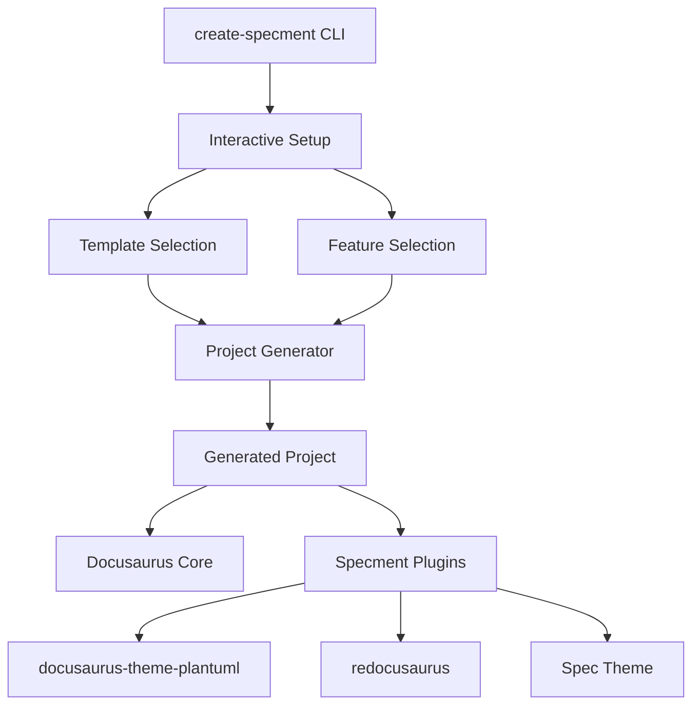

# Design Document: Specment Interactive Setup

## Overview

Specmentを、create-docusaurusをベースとしたインタラクティブな仕様書生成ツールとして再設計する。Storybookのような使いやすさと、create-better-t-stackのようなインタラクティブセットアップを提供し、仕様書作成に特化した機能を統合する。

### 設計原則

1. **シンプルさ**: `ni` → markdown作成 → `nr dev` の3ステップワークフロー
2. **選択の自由**: 必要な機能のみを選択してインストール
3. **Docusaurus互換**: 既存のDocusaurusエコシステムとの完全互換性
4. **拡張性**: プラグインシステムによる機能拡張
5. **パッケージマネージャー統一**: `ni`を使用してパッケージマネージャーの差異を吸収

## Architecture

### システム構成



### パッケージ構成

```
@specment/
├── create-specment/          # メインCLIツール
├── theme-spec/              # 仕様書特化テーマ
├── plugin-spec-templates/   # 仕様書テンプレートプラグイン
└── templates/               # プロジェクトテンプレート集
    ├── classic-spec/
    ├── project-analysis/     # プロジェクト概要・分析
    ├── requirements/         # 要件定義
    ├── external-design/      # 外部設計
    └── internal-design/      # 内部設計

# 外部依存プラグイン
├── docusaurus-theme-plantuml    # PlantUML統合
└── redocusaurus                 # Redoc統合
```

## Components and Interfaces

### 1. Create-Specment CLI

**責任**: プロジェクト生成とインタラクティブセットアップ

```typescript
interface CreateSpecmentOptions {
  projectName: string;
  template: TemplateType;
  features: FeatureSelection[];
  skipInstall: boolean;
}

interface TemplateType {
  name: 'classic-spec' | 'project-analysis' | 'requirements' | 'external-design' | 'internal-design';
  description: string;
  features: string[];
}

interface FeatureSelection {
  name: string;
  enabled: boolean;
  plugin?: string;
  config?: Record<string, any>;
}
```

### 2. Template System

**責任**: プロジェクトテンプレートの管理と生成

```typescript
interface TemplateConfig {
  name: string;
  description: string;
  docusaurusConfig: DocusaurusConfig;
  defaultFeatures: string[];
  directoryStructure: DirectoryStructure;
  sampleContent: ContentFile[];
}

interface DirectoryStructure {
  docs: string[];
  static: string[];
  src?: string[];
}

interface ContentFile {
  path: string;
  content: string;
  template: boolean;
}
```

### 3. Plugin System

**責任**: 機能拡張とDocusaurus統合

```typescript
interface SpecmentPlugin {
  name: string;
  version: string;
  docusaurusPlugin?: string;
  config: PluginConfig;
  dependencies: string[];
  setup: (config: DocusaurusConfig) => DocusaurusConfig;
}

interface PluginConfig {
  required: boolean;
  defaultEnabled: boolean;
  configOptions: ConfigOption[];
}
```

### 4. Interactive Setup

**責任**: ユーザーインタラクションとプロジェクト設定

```typescript
interface SetupFlow {
  steps: SetupStep[];
  currentStep: number;
  selections: UserSelections;
}

interface SetupStep {
  type: 'input' | 'select' | 'multiselect' | 'confirm';
  name: string;
  message: string;
  choices?: Choice[];
  validate?: (input: any) => boolean | string;
}

interface UserSelections {
  projectName: string;
  template: string;
  features: string[];
}
```

## Data Models

### プロジェクト設定

```typescript
interface SpecmentConfig {
  version: string;
  template: string;
  features: EnabledFeature[];
  docusaurus: DocusaurusConfig;
  specment: SpecmentSettings;
}

interface EnabledFeature {
  name: string;
  plugin: string;
  config: Record<string, any>;
}

interface SpecmentSettings {
  docsDir: string;
  templatesDir: string;
  theme: string;
  plugins: string[];
}
```

### テンプレート定義

```typescript
interface TemplateDefinition {
  metadata: TemplateMetadata;
  structure: ProjectStructure;
  content: TemplateContent[];
  config: TemplateConfig;
}

interface TemplateMetadata {
  name: string;
  displayName: string;
  description: string;
  version: string;
  author: string;
  tags: string[];
}

interface ProjectStructure {
  directories: string[];
  files: FileTemplate[];
}

interface FileTemplate {
  path: string;
  template: string;
  variables: TemplateVariable[];
}
```

## Correctness Properties

*A property is a characteristic or behavior that should hold true across all valid executions of a system-essentially, a formal statement about what the system should do. Properties serve as the bridge between human-readable specifications and machine-verifiable correctness guarantees.*

### Property 1: プロジェクト生成の完全性
*For any* valid template and feature selection, the generated project should contain all required files and configurations for the selected features
**Validates: Requirements 1.5, 2.5**

### Property 2: Docusaurus互換性
*For any* generated project, the standard Docusaurus commands (start, build, serve) should work without errors
**Validates: Requirements 4.2, 4.3**

### Property 3: 機能選択の一貫性
*For any* selected feature, the corresponding plugin should be properly installed and configured in the generated project
**Validates: Requirements 3.5, 5.5**

### Property 4: テンプレート構造の整合性
*For any* template, the generated directory structure should match the template definition exactly
**Validates: Requirements 2.5**

### Property 5: 設定ファイルの有効性
*For any* generated project, the docusaurus.config.js file should be syntactically valid and contain all required configurations
**Validates: Requirements 4.1, 8.3**

### Property 6: 依存関係の解決
*For any* feature selection, all required dependencies should be correctly added to package.json with compatible versions
**Validates: Requirements 3.5, 5.5**

### Property 7: インタラクティブセットアップの完了
*For any* user input sequence, the setup process should either complete successfully or provide clear error messages
**Validates: Requirements 1.1, 1.5**

### Property 8: 既存プロジェクト統合の安全性
*For any* existing Docusaurus project, adding Specment features should not break existing functionality
**Validates: Requirements 7.1, 7.4**

## Error Handling

### エラー分類

1. **ユーザー入力エラー**
   - 無効なプロジェクト名
   - 存在しないテンプレート選択
   - 互換性のない機能組み合わせ

2. **システムエラー**
   - ネットワーク接続エラー
   - ファイルシステムアクセスエラー
   - 依存関係解決エラー

3. **設定エラー**
   - 無効な設定ファイル
   - プラグイン設定の競合
   - バージョン互換性エラー

### エラー処理戦略

```typescript
interface ErrorHandler {
  handleUserInputError(error: UserInputError): void;
  handleSystemError(error: SystemError): void;
  handleConfigError(error: ConfigError): void;
  recoverFromError(error: Error): boolean;
}

class SpecmentErrorHandler implements ErrorHandler {
  handleUserInputError(error: UserInputError): void {
    // ユーザーフレンドリーなエラーメッセージを表示
    // 修正方法を提案
    // 再入力を促す
  }

  handleSystemError(error: SystemError): void {
    // システムエラーをログに記録
    // 代替手段を提案
    // 必要に応じてロールバック
  }

  handleConfigError(error: ConfigError): void {
    // 設定の問題を特定
    // 自動修正を試行
    // 手動修正の手順を提示
  }
}
```

## Testing Strategy

### 単体テスト
- 各コンポーネントの個別機能テスト
- エラーハンドリングのテスト
- 設定ファイル生成のテスト

### 統合テスト
- エンドツーエンドのプロジェクト生成テスト
- 異なるテンプレートと機能組み合わせのテスト
- 既存プロジェクトへの統合テスト

### プロパティベーステスト
- 最小100回の反復実行
- 各プロパティテストは対応する設計プロパティを参照
- タグ形式: **Feature: specment-interactive-setup, Property {number}: {property_text}**

### テスト環境
- Node.js 20+での動作確認
- `ni`を使用したパッケージマネージャー統一
- Windows, macOS, Linuxでの動作確認

### 外部依存関係
- **docusaurus-theme-plantuml**: PlantUML図表統合
- **redocusaurus**: OpenAPI仕様書のRedoc表示
- **ni**: パッケージマネージャー統一ツール