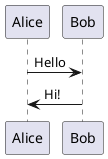

# create-specment

Docusaurusベースの仕様書作成に特化したインタラクティブなプロジェクト生成ツール

## 概要

`create-specment`は、仕様書作成に特化したDocusaurusプロジェクトを簡単に生成できるCLIツールです。Storybookのような使いやすさと、create-better-t-stackのようなインタラクティブセットアップを提供し、仕様書作成に必要な機能を統合したツールです。

## 特徴

1. 🚀 **インタラクティブセットアップ**: 質問に答えるだけでプロジェクトを生成
1. 📋 **5つの専用テンプレート**: 用途に応じた最適なテンプレートを選択
1. 🔧 **機能選択**: PlantUML、Redoc、検索、多言語対応などを選択可能
1. 📝 **変数置換**: プロジェクト名や作成者情報を自動で置換
1. 🎨 **Docusaurus互換**: 既存のDocusaurusエコシステムと完全互換

## 導入手順

### 前提条件

以下のソフトウェアがインストールされている必要があります:

1. **WSL(Windows環境の場合)**
    1. Windows環境では Windows Subsystem for Linux (WSL) の使用を強く推奨
    1. Ubuntu 22.04 LTS 以上を推奨
    ```bash
    # WSL のインストール(Windows PowerShell で管理者権限で実行)
    wsl --install
    ```

1. **mise(開発環境管理ツール)**
    ```bash
    # mise のインストール(Linux/macOS/WSL)
    curl https://mise.run | sh
    
    # シェルの設定を更新
    echo 'eval "$(mise activate bash)"' >> ~/.bashrc
    source ~/.bashrc
    ```

1. **Node.js (LTS以上推奨、mise経由でインストール推奨)**
    ```bash
    # mise を使用してNode.jsをインストール
    mise install node@lts
    mise use node@lts
    
    # バージョン確認
    node --version
    ```

1. **ni(パッケージマネージャー統一ツール)**
    ```bash
    # mise を使用してniのインストール
    mise install npm:@antfu/ni@latest
    
    # バージョン確認
    ni --version
    ```

### インストール方法

#### 方法1: ni を使用(推奨)

```bash
# ni を使用してプロジェクトを作成
nlx create-specment@latest my-docs
cd my-docs

# ni を使用して依存関係をインストール
ni

# ni を使用して開発サーバーを起動
nr start
```

#### 方法2: npx を使用

```bash
# 最新版を使用してプロジェクトを作成
npx create-specment@latest my-docs

# 特定のテンプレートを指定
npx create-specment@latest my-docs --template requirements
```

#### 方法3: グローバルインストール

```bash
# グローバルにインストール
npm install -g create-specment

# プロジェクトを作成
create-specment my-docs
```

### 基本的な使用方法

1. **プロジェクトの作成**
    ```bash
    nlx create-specment@latest my-docs
    cd my-docs
    ```

1. **インタラクティブセットアップ**
    
    以下の質問に答えてプロジェクトを設定します:
    
    1. **プロジェクト名**: ドキュメントサイトの名前
    1. **テンプレート選択**: 用途に応じたテンプレートを選択
    1. **機能選択**: 必要な機能を選択

1. **開発サーバーの起動**
    ```bash
    # 依存関係のインストール(自動実行されない場合)
    ni
    
    # 開発サーバーを起動
    nr start
    ```

1. **ビルドとデプロイ**
    ```bash
    # 本番用ビルド
    nr build
    
    # ローカルでプレビュー
    nr serve
    ```

## テンプレート一覧

### 1. Classic Specification(classic-spec)
汎用的な仕様書テンプレート。基本的なドキュメント構造を提供します。

**適用場面**:
1. 一般的な技術仕様書
1. プロダクト仕様書
1. 基本的なドキュメント作成

### 2. Project Analysis(project-analysis)
プロジェクト概要・分析用テンプレート。プロジェクトの全体像を把握するための構造を提供します。

**適用場面**:
1. プロジェクト企画書
1. 現状分析レポート
1. SWOT分析ドキュメント

### 3. Requirements Specification(requirements)
要件定義書テンプレート。機能要件・非機能要件を体系的に整理できます。

**適用場面**:
1. システム要件定義書
1. 機能仕様書
1. EARS形式での要件記述

### 4. External Design(external-design)
外部設計書テンプレート。システム外部とのインターフェース設計に特化しています。

**適用場面**:
1. システムアーキテクチャ設計書
1. API設計書
1. UI/UX設計書

### 5. Internal Design(internal-design)
内部設計書テンプレート。システム内部の詳細設計とアルゴリズムに特化しています。

**適用場面**:
1. 詳細設計書
1. データベース設計書
1. アルゴリズム仕様書

## 機能選択

### PlantUML統合
UML図やシーケンス図を簡単に作成できます。



### Redoc統合
OpenAPI仕様書を美しく表示できます。

### 多言語対応
複数言語でのドキュメント作成をサポートします。

## コマンドラインオプション

```bash
create-specment [project-name] [options]

Options:
  --template <template>  使用するテンプレート (classic-spec|project-analysis|requirements|external-design|internal-design)
  --skip-install        依存関係のインストールをスキップ
  --verbose             詳細なログを表示
  -h, --help           ヘルプを表示
  -V, --version        バージョンを表示
```

## トラブルシューティング

### よくある問題

#### 1. Node.jsのバージョンエラー
```bash
Error: Node.js version 20.0 or higher is required
```

**解決方法**:
```bash
# Node.jsのバージョンを確認
node --version

# mise を使用してNode.jsをアップデート
mise install node@latest
mise use node@latest
```

#### 2. パッケージインストールエラー
```bash
Error: Failed to install dependencies
```

**解決方法**:
```bash
# キャッシュをクリア
ni clean
# または手動でクリア
npm cache clean --force

# 再度インストール
ni
```

#### 3. ポート競合エラー
```bash
Error: Port 3000 is already in use
```

**解決方法**:
```bash
# 別のポートを指定
nr start -- --port 3001
```

### Windows環境での注意事項

1. **WSL の使用を強く推奨**
    1. Windows環境では WSL (Windows Subsystem for Linux) の使用を強く推奨します
    1. PowerShellやコマンドプロンプトでの動作は保証されません
    1. Ubuntu 22.04 LTS 以上を推奨
1. **開発環境の統一**
    1. mise + ni の組み合わせにより、環境差異を最小限に抑制
    1. WSL内でLinux環境として動作させることで、macOS/Linuxと同等の体験を提供

## 開発環境のセットアップ

プロジェクトの開発に参加する場合:

```bash
# リポジトリをクローン
git clone https://github.com/plenarc/create-specment.git
cd create-specment

# 依存関係をインストール
ni

# 開発モードで実行
nr dev

# テストを実行
nr test

# ビルド
nr build
```

## ライセンス

MIT License - 詳細は [LICENSE](LICENSE) ファイルを参照してください。

## 貢献

プロジェクトへの貢献を歓迎します！詳細は [CONTRIBUTING.md](CONTRIBUTING.md) を参照してください。

## サポート

1. 🐛 **バグレポート**: [GitHub Issues](https://github.com/plenarc/create-specment/issues)
1. 💡 **機能要望**: [GitHub Discussions](https://github.com/plenarc/create-specment/discussions)
1. 📖 **ドキュメント**: [公式ドキュメント](https://create-specment.dev)

## 関連プロジェクト

1. [Docusaurus](https://docusaurus.io/) - 静的サイトジェネレーター
1. [mise](https://mise.jdx.dev/) - 開発環境管理ツール
1. [ni](https://github.com/antfu/ni) - パッケージマネージャー統一ツール
1. [PlantUML](https://plantuml.com/) - UML図作成ツール
1. [Redoc](https://redocly.github.io/redoc/) - OpenAPI仕様書表示ツール
