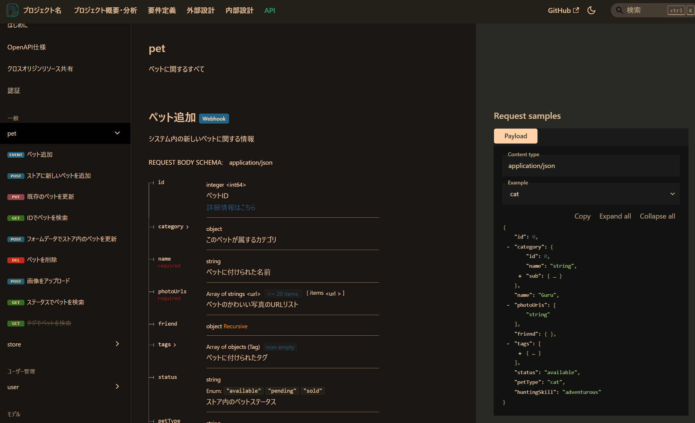
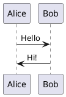

# create-specment

[](https://www.npmjs.com/package/@plenarc/create-specment)
[](LICENSE)

[English](README.md) | [日本語](README-jp.md)

Demo: https://plenarc.github.io/specment/

1. 'specification' + 'document' => Specment
1. A site generation tool specializing in creating specification documents based on Docusaurus.


<div align="center">
  <table>
    <tr>
      <td align="center">
        
        <br>
        <em>Example: Project Overview</em>
      </td>
      <td align="center">
        
        <br>
        <em>Example: As-Is Current State Analysis</em>
      </td>
      <td align="center">
        
        <br>
        <em>Example: Redoc (OpenAPI)</em>
      </td>
    </tr>
  </table>
</div>

## Overview

`create-specment` is a CLI tool that easily generates Docusaurus projects specialized for specification documentation. It provides Storybook-like ease of use and create-better-t-stack-like interactive setup, integrating all the features needed for specification documentation creation.

## Features

1. 🚀 **Interactive Setup**: Generate projects by simply answering questions
1. 📋 **4 Specialized Templates**: Choose optimal templates based on your use case
1. 🔧 **Feature Selection**: Select PlantUML, Redoc, search, multilingual support, and more
1. 📝 **Variable Substitution**: Automatically replace project names and author information
1. 🎨 **Docusaurus Compatible**: Fully compatible with the existing Docusaurus ecosystem

## Installation Guide

### Prerequisites

The following software must be installed:

1. **WSL (for Windows environments)**
    1. For Windows environments, we strongly recommend using Windows Subsystem for Linux (WSL)
    1. Ubuntu 22.04 LTS or higher is recommended

    ```bash
    # Install WSL (run in Windows PowerShell with administrator privileges)
    wsl --install
    ```

1. **mise (development environment management tool)**

    ```bash
    # Install mise (Linux/macOS/WSL)
    curl https://mise.run | sh

    # Update shell configuration
    echo 'eval "$(mise activate bash)"' >> ~/.bashrc
    source ~/.bashrc
    ```

1. **Node.js (LTS or higher recommended, installation via mise recommended)**

    ```bash
    # Install Node.js using mise
    mise install node@lts
    mise use node@lts

    # Check version
    node --version
    ```

1. **ni (package manager unification tool)**

    ```bash
    # Install ni using mise
    mise use npm:@antfu/ni@latest

    # Check version
    ni --version
    ```

### Installation Methods

#### Method 1: Using ni (Recommended)

```bash
# Create project using ni
nlx create-specment@latest my-docs
cd my-docs

# Install dependencies using ni
ni

# Start development server using ni
nr start
```

#### Method 2: Using npx

```bash
# Create project using the latest version
npx create-specment@latest my-docs

# Specify a specific template
npx create-specment@latest my-docs --template api-spec
```

#### Method 3: Global Installation

```bash
# Install globally
npm install -g create-specment

# Create project
create-specment my-docs
```

### Basic Usage

1. **Create Project**

    ```bash
    nlx create-specment@latest my-docs
    cd my-docs
    ```

1. **Interactive Setup**

    Configure your project by answering the following questions:

    1. **Language Selection**: Choose display language (English/Japanese)
    1. **Project Name**: Name of your documentation site
    1. **Template Selection**: Choose templates based on your use case (multiple selection)
    1. **Feature Selection**: Select the features you need

1. **Start Development Server**

    ```bash
    # Install dependencies (if not automatically executed)
    ni

    # Start development server
    nr start
    ```

1. **Build and Deploy**

    ```bash
    # Production build
    nr build

    # Local preview
    nr serve
    ```

## Template List

### 1. Classic Specification (classic-spec)
General-purpose specification template. Provides basic document structure.

**Use Cases**:
1. General technical specifications
1. Product specifications
1. Basic documentation creation

### 2. API Specification (api-spec)
API specification template. Specialized for API documentation and OpenAPI specifications.

**Use Cases**:
1. REST API documentation
1. OpenAPI specifications
1. API reference guides

### 3. Technical Specification (technical-spec)
Technical specification template. Focused on detailed technical documentation and system design.

**Use Cases**:
1. System requirements documentation
1. Functional specifications
1. EARS format requirement descriptions

### 4. Enterprise Specification (enterprise-spec)
Enterprise specification template. Designed for large-scale enterprise documentation with comprehensive structure.

**Use Cases**:
1. Enterprise system architecture documentation
1. Comprehensive project documentation
1. Multi-stakeholder documentation

## Feature Selection

### PlantUML Integration
Easily create UML diagrams and sequence diagrams.



### Redoc Integration
Beautifully display OpenAPI specifications.

### Multilingual Support
Support for creating documentation in multiple languages.

## Command Line Options

```bash
create-specment [project-name] [options]

Options:
  --template <template>  Template to use (classic-spec|api-spec|technical-spec|enterprise-spec)
  --skip-install        Skip dependency installation
  --verbose             Show detailed logs
  -h, --help           Show help
  -V, --version        Show version
```

## Troubleshooting

### Common Issues

#### 1. Node.js Version Error

```bash
Error: Node.js version 20.0 or higher is required
```

**Solution**:

```bash
# Check Node.js version
node --version

# Update Node.js using mise
mise install node@latest
mise use node@latest
```

#### 2. Package Installation Error

```bash
Error: Failed to install dependencies
```

**Solution**:

```bash
# Clear cache
ni clean
# Or manually clear
npm cache clean --force

# Reinstall
ni
```

#### 3. Port Conflict Error

```bash
Error: Port 3000 is already in use
```

**Solution**:

```bash
# Specify a different port
nr start -- --port 3001
```

### Notes for Windows Environment

1. **Strongly recommend using WSL**
    1. For Windows environments, we strongly recommend using WSL (Windows Subsystem for Linux)
    1. Operation in PowerShell or Command Prompt is not guaranteed
    1. Ubuntu 22.04 LTS or higher is recommended
1. **Unified Development Environment**
    1. The combination of mise + ni minimizes environment differences
    1. Running as a Linux environment within WSL provides an experience equivalent to macOS/Linux

## Development Environment Setup

To participate in project development:

```bash
# Clone repository
git clone https://github.com/plenarc/create-specment.git
cd create-specment

# Install dependencies
ni

# Run in development mode
nr dev

# Run tests
nr test

# Build
nr build
```

## License

MIT License - See the [LICENSE](LICENSE) file for details.

## Contributing

We welcome contributions to the project! See [CONTRIBUTING.md](CONTRIBUTING.md) for details.

## Support

1. 🐛 **Bug Reports**: [GitHub Issues](https://github.com/plenarc/create-specment/issues)
1. 💡 **Feature Requests**: [GitHub Discussions](https://github.com/plenarc/create-specment/discussions)
1. 📖 **Documentation**: [Official Documentation](https://create-specment.dev)

## Related Projects

1. [Docusaurus](https://docusaurus.io/) - Static site generator
1. [mise](https://mise.jdx.dev/) - Development environment management tool
1. [ni](https://github.com/antfu/ni) - Package manager unification tool
1. [PlantUML](https://plantuml.com/) - UML diagram creation tool
1. [Redoc](https://redocly.github.io/redoc/) - OpenAPI specification display tool
